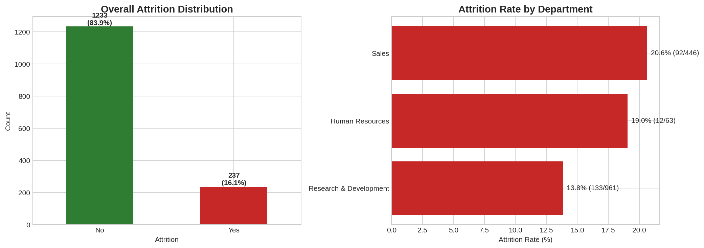
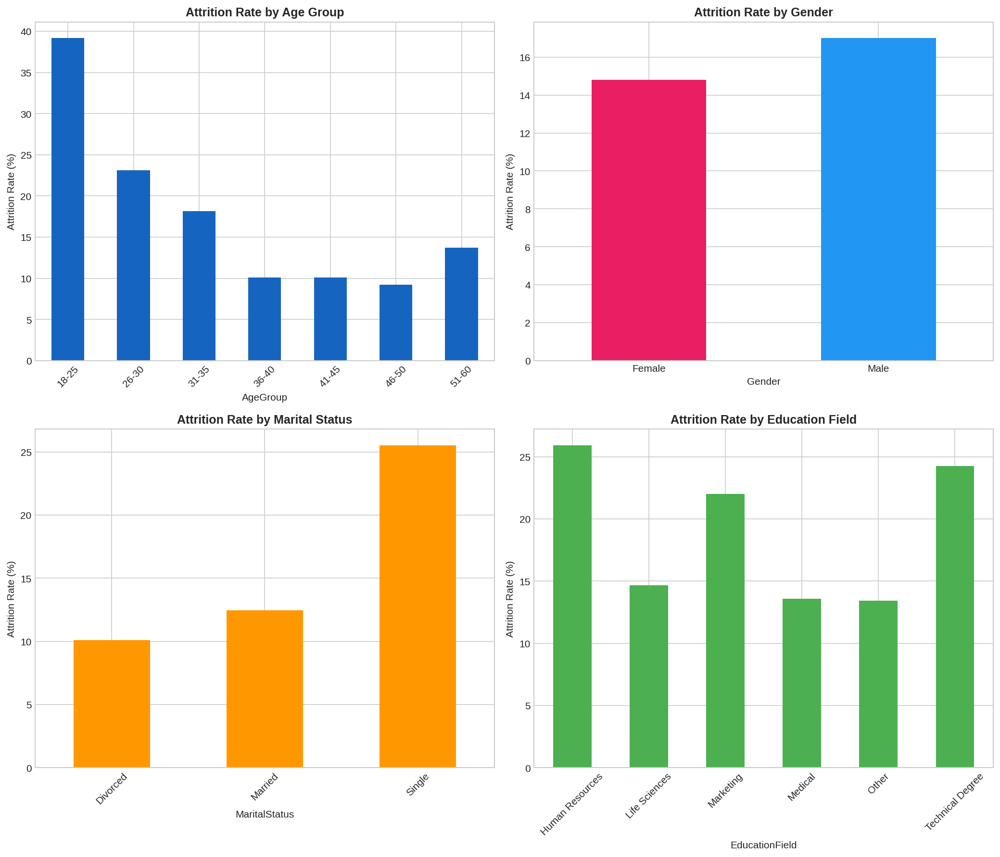
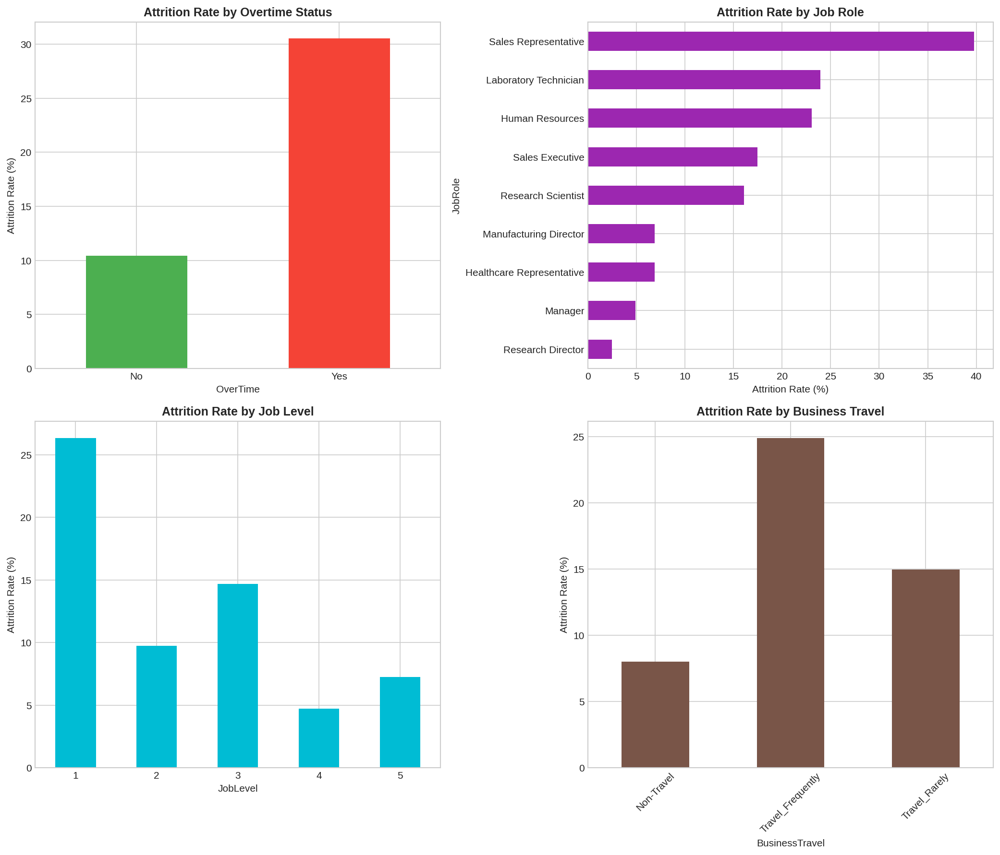
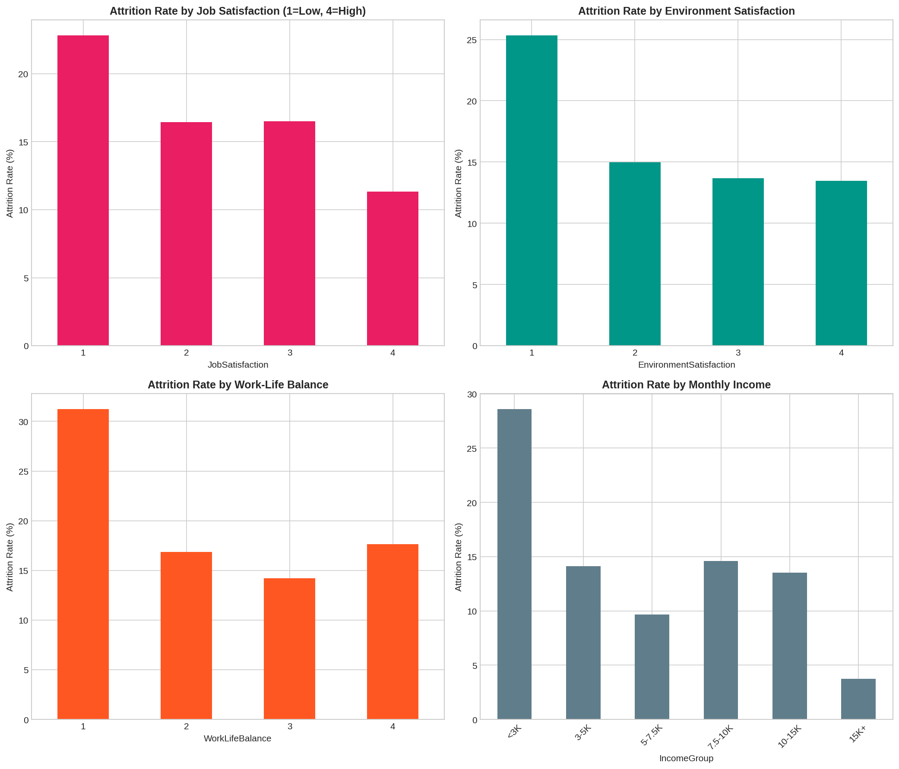
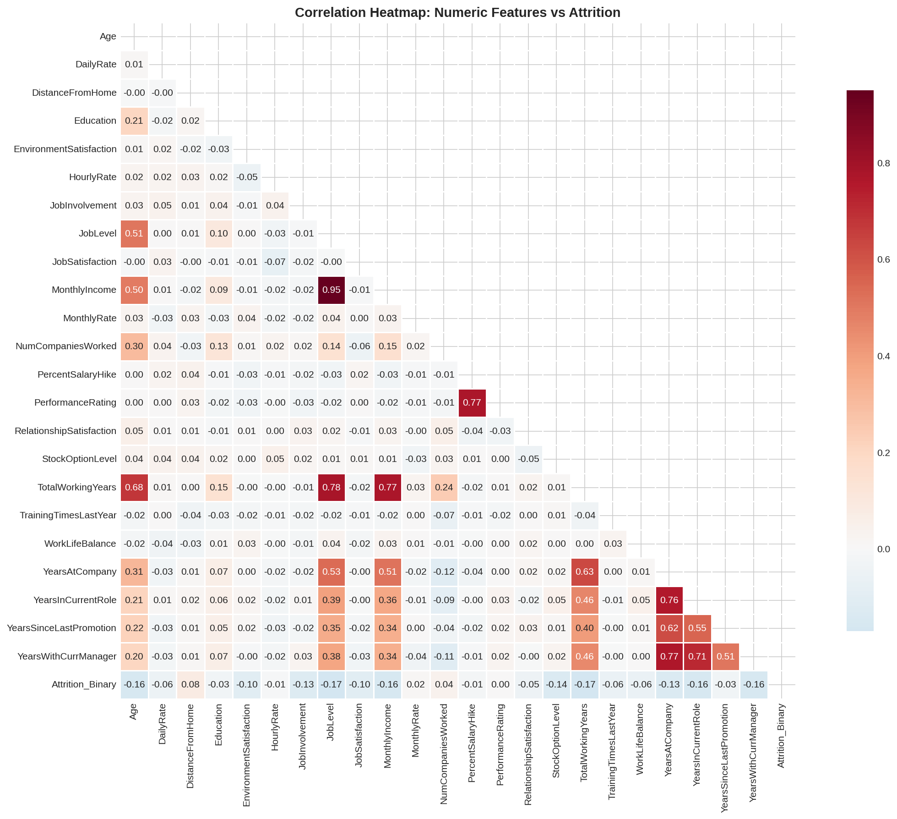
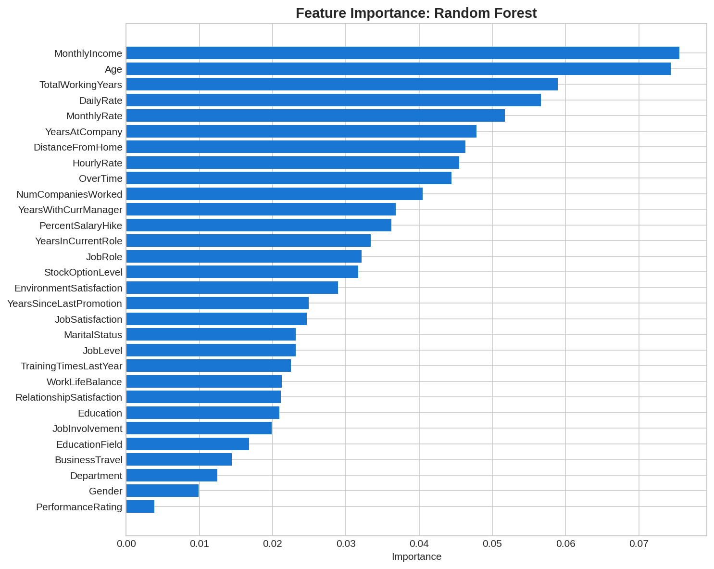
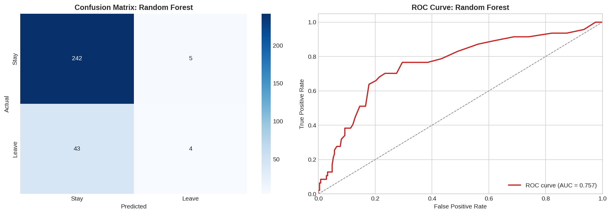
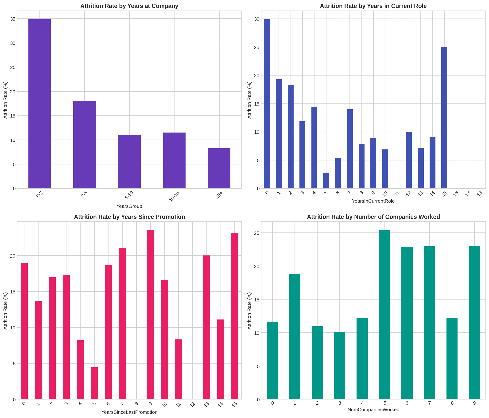
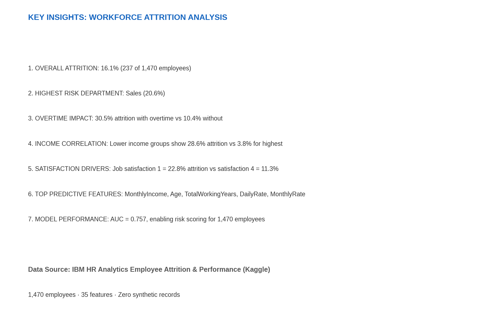

## Project 1: Attrition Prediction Model

**Context:** Workforce attrition prediction inspired by Akin Gump's 87% accuracy logistic regression models and WMATA's Azure ML attrition workflows.

**Dataset:**
- [IBM HR Analytics Employee Attrition & Performance](https://www.kaggle.com/datasets/pavansubhasht/ibm-hr-analytics-attrition-dataset) — 1,470 employee records with attrition labels and performance metrics
- [Bureau of Labor Statistics turnover data](https://www.bls.gov/) — official U.S. labor statistics

All data is sourced from public datasets. No synthetic or simulated records.

**Objective:** Build predictive models that identify employees at risk of voluntary departure with >85% accuracy, enabling proactive retention strategies.

**Techniques:**
- Logistic regression with feature importance analysis
- Random forest and gradient boosting classifiers
- Survival analysis (Cox PH) for time-to-event prediction
- SHAP explainability for HR-friendly model interpretation

**Business Impact:**
- 87% accuracy in attrition prediction
- 30% reduction in voluntary turnover
- Targeted retention strategies for high-risk profiles
- Executive-ready risk dashboards

**Files:**
- `notebooks/01_hr_data_exploration.ipynb`
- `notebooks/02_attrition_baseline.ipynb`
- `notebooks/03_advanced_models.ipynb`
- `notebooks/04_survival_analysis.ipynb`
- `src/preprocess.py`
- `src/train_attrition_model.py`
- `src/predict.py`
- `dashboard/attrition_dashboard.py`

## Figure Gallery

| # | Figure | Insight |
|---|--------|---------|
| 01 |  | Company-wide attrition rate and risk distribution |
| 02 |  | Attrition by age, gender, department, and role |
| 03 |  | Overtime, travel, and job-level risk drivers |
| 04 |  | Job satisfaction vs. monthly income by attrition status |
| 05 |  | Feature correlation matrix for model inputs |
| 06 |  | Random Forest feature importance ranking |
| 07 |  | ROC curve, confusion matrix, precision-recall |
| 08 |  | Years at company, years in role, total working years |
| 09 |  | Executive summary of top risk factors |

**All figures generated from IBM HR Analytics public dataset (1,470 records).**
