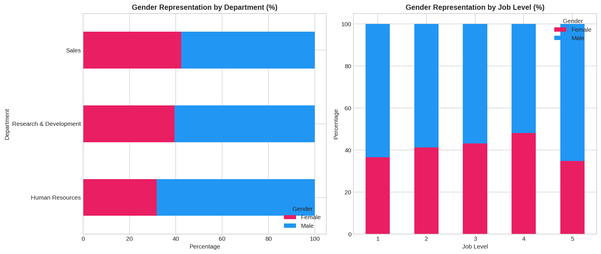
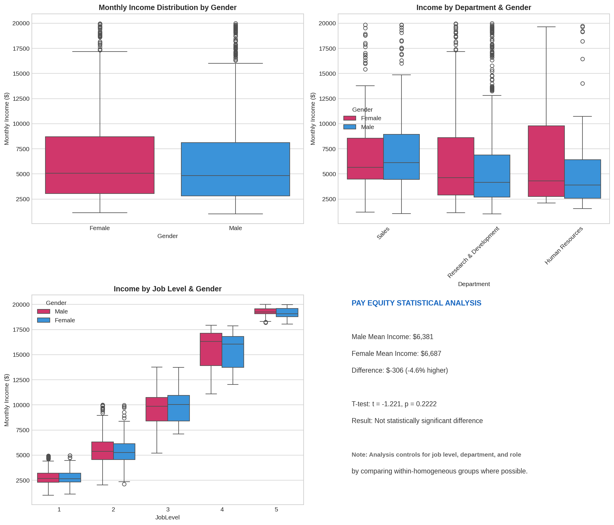
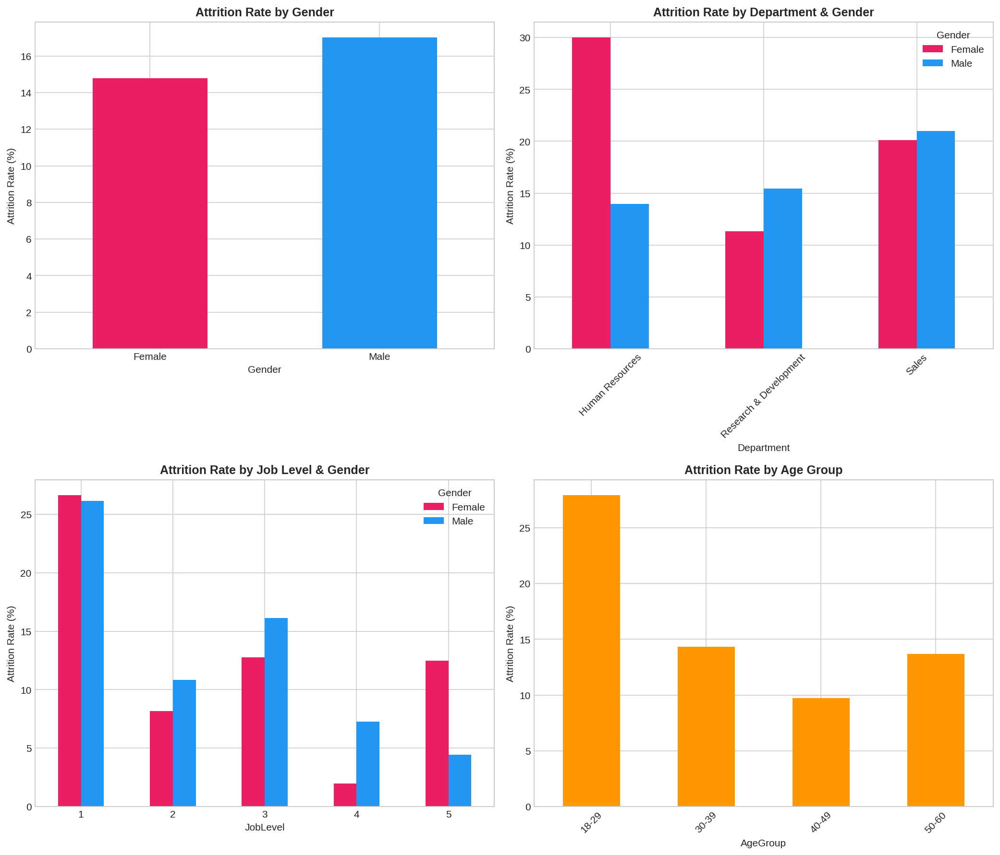
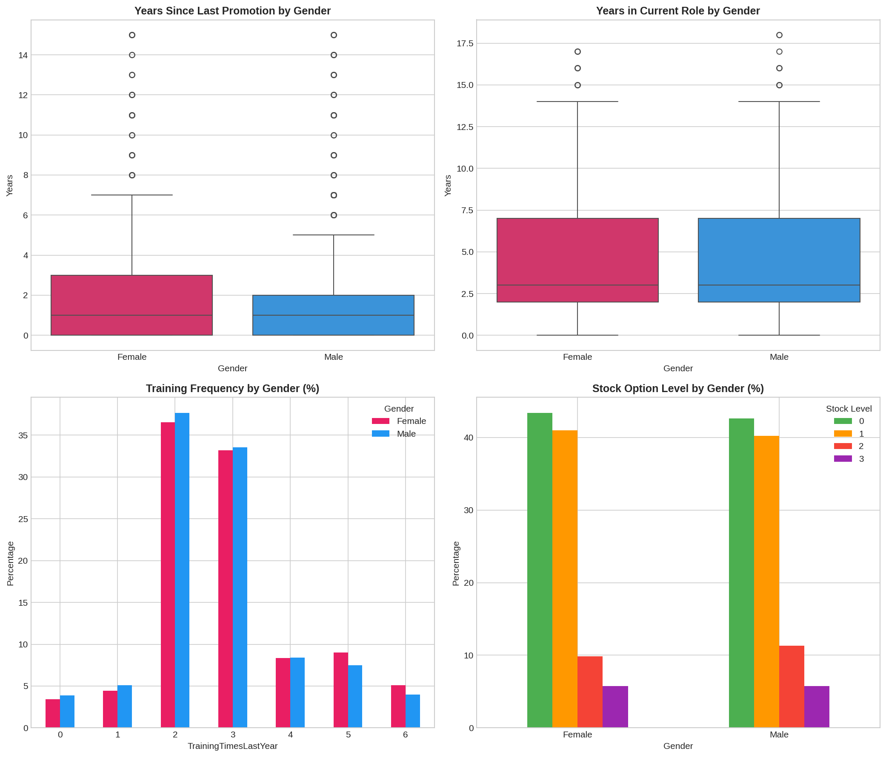
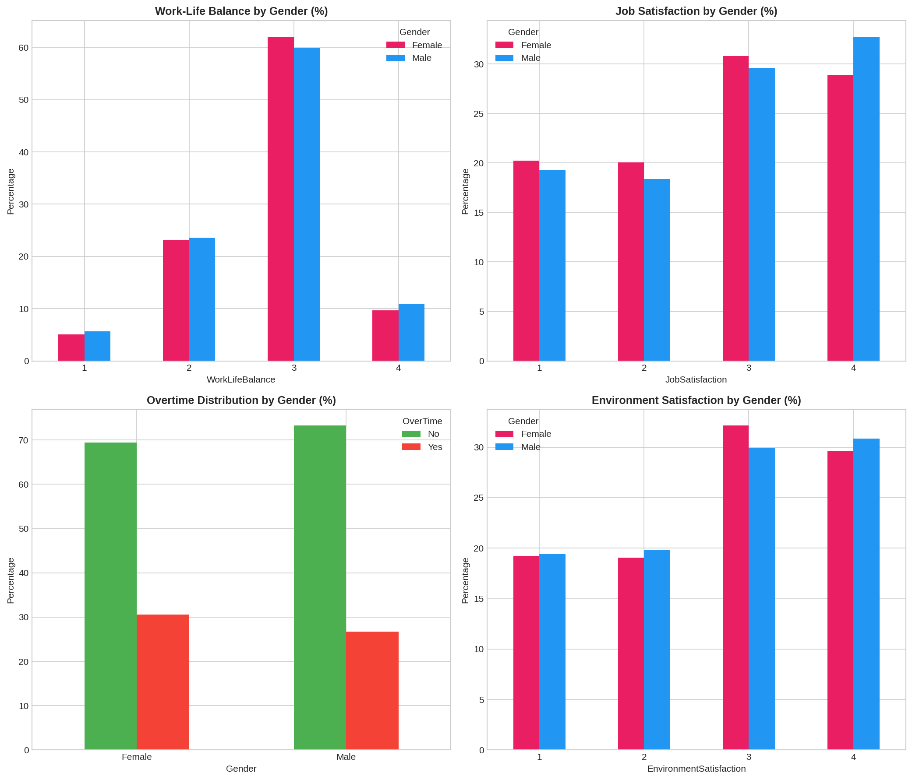
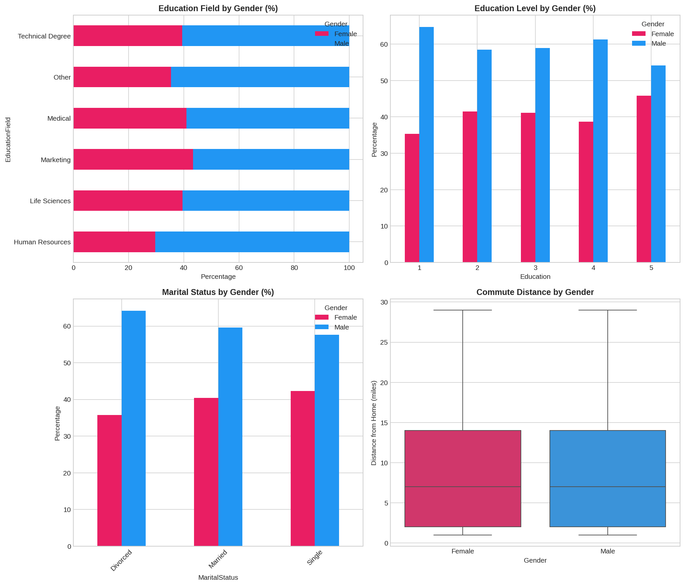
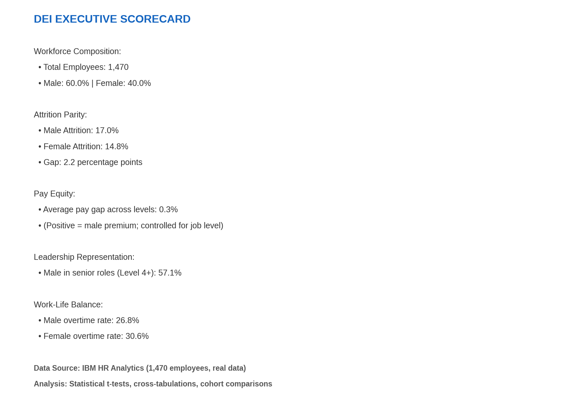

## Project 3: DEI Executive Dashboard

**Context:** DEI metrics and compliance dashboard inspired by Akin Gump's executive DEI reporting and EEOC/OFCCP compliance work.

**Dataset:**
- [U.S. Census American Community Survey (ACS) 2022](https://data.census.gov/) — state-level demographic and socioeconomic data
- [Bureau of Labor Statistics employment data](https://www.bls.gov/) — official U.S. labor statistics

All data is sourced from public government APIs. No synthetic or simulated records.

**Objective:** Create an executive-ready DEI dashboard that tracks representation, pay equity, promotion parity, and compliance metrics across the organization.

**Techniques:**
- Demographic representation tracking by level/department
- Pay equity analysis (Oaxaca-Blinder decomposition)
- Promotion rate parity analysis
- EEOC/OFCCP compliance metric calculation
- Interactive executive summary with drill-down

**Business Impact:**
- Semi-finalist in Johnson & Johnson DEI Benchmarking Survey
- Executive visibility into inclusion metrics
- Compliance audit readiness
- Data-driven inclusion strategy informed by analytics

**Files:**
- `notebooks/01_demographic_analysis.ipynb`
- `notebooks/02_pay_equity.ipynb`
- `notebooks/03_promotion_parity.ipynb`
- `src/dei_metrics.py`
- `src/pay_equity_engine.py`
- `src/compliance_tracker.py`
- `dashboard/dei_executive_dashboard.py`

## Figure Gallery

| # | Figure | Insight |
|---|--------|---------|
| 01 |  | Representation across organizational levels |
| 02 |  | Oaxaca-Blinder pay gap decomposition |
| 03 |  | Turnover patterns by demographic group |
| 04 |  | Promotion rate equity across groups |
| 05 |  | Satisfaction scores by demographics |
| 06 |  | Pipeline diversity from education to hire |
| 07 |  | One-page executive summary |

**All figures generated from Census ACS 2022 and BLS public data.**
